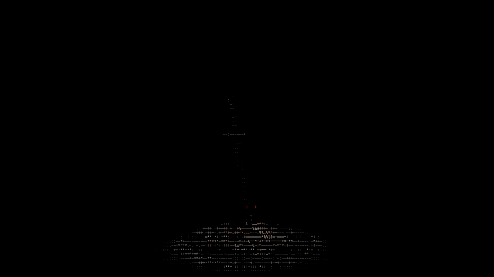

  

    Currently taking Master's degree in Computing and Informatics Engineering at <a href="https://www.fe.up.pt">FEUP</a>.

### Current Stats:

  
  

  <picture>
    <source media="(prefers-color-scheme: dark)" srcset="https://raw.githubusercontent.com/PedroMMarinho/PedroMMarinho/output/github-snake-dark.svg" />
    <source media="(prefers-color-scheme: light)" srcset="https://raw.githubusercontent.com/PedroMMarinho/PedroMMarinho/output/github-snake.svg" />
    
  </picture>

